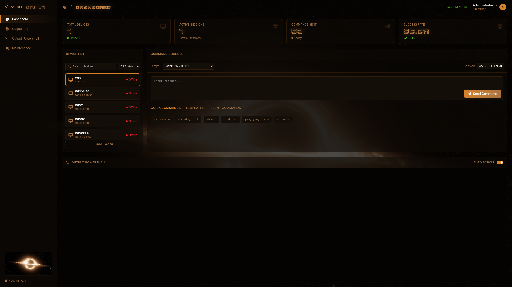

# 🛡️ Admin-Panel: Full-Stack C2 Infrastructure Simulation

[]()
[](LICENSE)
[]()
[]()

`Admin-Panel` adalah proyek pengembangan aplikasi full-stack (*Web Frontend* & *Node.js Backend*) yang mensimulasikan antarmuka manajemen (Control Panel) untuk infrastruktur Command and Control (C2). Proyek ini dirancang untuk mempelajari alur pertukaran data, manajemen *state*, dan arsitektur komunikasi jaringan antara panel kontrol dan agen simulasi dalam ruang lingkup riset keamanan siber.

---

## ⚠️ Disclaimer & Legal Notice

> 🚨 **PENTING:** Repositori ini dibuat **murni untuk tujuan edukasi, riset akademis, dan pemahaman arsitektur perangkat lunak**. Kode di dalam repositori ini **tidak ditujukan untuk aktivitas ilegal** atau pengujian tanpa izin. Penulis tidak bertanggung jawab atas segala bentuk penyalahgunaan kode ini. Segala aktivitas pengujian wajib dilakukan di lingkungan laboratorium yang terisolasi (*sandbox* / *host-only network*).

---

## 📸 Preview & Demo

Berikut adalah tampilan antarmuka dari simulasi proyek ini:

### 🌐 Landing Page

*Keterangan singkat mengenai aset visual (menggunakan latar belakang `blackhole.mp4`).*

### 🎮 C2 Management Dashboard

*Tampilan panel utama tempat simulasi pengiriman perintah dan pemantauan agen.*

---

## 🤖 Catatan Pengembangan (AI-Assisted Development)

Proyek ini memanfaatkan teknologi kecerdasan buatan (AI) dalam proses pembuatan kode backend (*Node.js*) untuk mempercepat pembuatan prototipe dan efisiensi waktu pengembangan. 

Fokus utama penulis dalam proyek ini adalah:
1. **System Integration:** Memahami bagaimana mengintegrasikan logika sisi server (Backend) dengan antarmuka pengguna (Frontend).
2. **Architecture Mapping:** Merancang alur logika bagaimana perintah dikirim dari panel kontrol hingga diterima oleh sistem simulasi.

---

## ✨ Fitur Utama

### 🖥️ 1. Landing Page Interface
* Desain halaman depan modern yang responsif menggunakan standar industri.
* Implementasi elemen video (`blackhole.mp4`) untuk transisi visual antarmuka.

### 🎮 2. C2 Simulation Dashboard
* **Target Management:** Visualisasi status dan informasi dasar dari perangkat/agen simulasi yang terhubung.
* **Command Dispatcher:** Panel kendali terpusat untuk mengirimkan instruksi atau perintah spesifik ke sisi agen.
* **Activity Logs:** Pencatatan riwayat eksekusi perintah untuk kebutuhan audit dan analisis forensik.

---

## 📂 Struktur Repositori

Struktur repositori diatur sebagai berikut untuk memudahkan pengelolaan aset statis dan server backend:

```text
Admin-Panel/
├── assets/                 # Folder tempat menyimpan gambar screenshot untuk README
│   ├── landing-page-preview.png
│   └── dashboard-preview.png
├── index.html              # Landing page utama
├── blackhole.mp4           # Aset video latar belakang
├── blackhole_reverse.mp4   # Aset video alternatif/transisi
├── c2-panel/               # Antarmuka web khusus dashboard panel kontrol
├── backend/                # Server Node.js (API penanganan command & agen)
└── README.md
